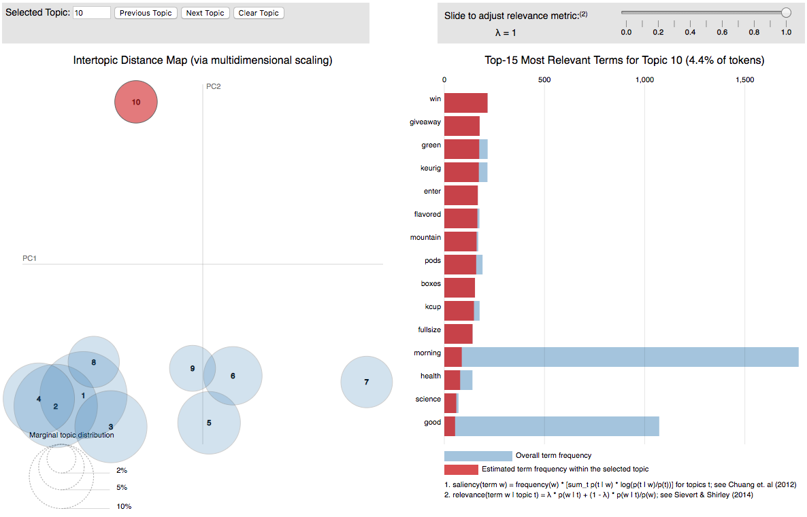

```{r setup, include=FALSE}
knitr::opts_chunk$set(echo = TRUE)
figwidth=10
figheight=6.5
```

Example of using the package rtweet to live scrape from twitter. Currently the code contains all the information required for running live, but when run as a markdown document uses pre-created files (in Blue Peter fassion "here's one I made earlier").

```{r, message=FALSE}
#Necessary packages for this script. If not in lib use fn install.packages()
library("rtweet")
library("httpuv")
library("ggplot2")
library("dplyr")
library("purrr")
library("lubridate")
library("tm")
library("wordcloud")
library("jsonlite")
library("lda")
library("LDAvis")
library("udpipe")
library("lattice")
library("tidytext")
```

# Getting the Data

What phrase do we want to search for?
```{r search-phrase, echo=TRUE}
#what do we want to search for? [NOTE "#coffee" is default saved file]
search_phrase <- '#coffee'
```

Use the package rtweet, which uses the twiiter API to collect the tweets.
```{r search-tweets, eval=FALSE}
## search for 1000 tweets (max 18,000 per 15 min interval) featuring the chosen 
## search_phrase. We only search for tweets written in english - which is 
## important when performing analysis on the text
## NOTE: May have to accept pop up and sign in to twitter at this stage
search_phrase <- '#coffee'
rt <- search_tweets(
  search_phrase,
  n = 18000, include_rts = FALSE,
  langs = 'en'
)
```

(in reality it's a pre-saved file)
```{r quick-search-tweets}
#read in the pre-run data as is a lot quicker. 
rt <- readRDS("rmd_stored_files/coffee_backup_tweets.rds")
```

# Initial Data Analysis

We can see our data has the dimensions `r dim(rt)` - which means `r dim(rt)[1]` individual tweets nad `r dim(rt)[2]` columns. The first few column names are
```{r colnames, echo=TRUE}
colnames(rt)[1:6] #first few column names. "text" is the tweet itself
```

## Individual Tweets
We can look at differing tweets of interest. For example, the earliest tweet in our data set. Note the url at the end - which we can click to go to that exact tweet!
```{r first-tweet}
first_tweet <- rt %>% 
  dplyr::select(text) %>% 
  head(1) %>%
  as.character()
print(first_tweet)
```

Alternatively, we can look at the tweet that got the most retweets:
```{r most-retweets, echo=FALSE}
most_pop <- rt %>% 
  filter(retweet_count == max(retweet_count))
print(most_pop$text)
```
That tweet had `r most_pop$retweet_count` retweets.

## Time of Tweet

Let's look at tweets we have over time. Between the earliest and the most recent tweet there is a time difference of `r round(as.numeric(max(rt$created_at) - min(rt$created_at)),2)` days.

Now let's plot the results. Note how the number of days matches the number of peaks - ie we have a daily pattern. This matches with intuiton about when during the day people are more likely to tweet.
```{r, fig.width=figwidth,fig.height=figheight}
rt %>%
  ts_plot(by = "1 hour") +
  ggplot2::theme_minimal() +
  ggplot2::theme(plot.title = ggplot2::element_text(face = "bold")) +
  ggplot2::labs(
    x = NULL, y = NULL,
    title = paste("Frequency of",search_phrase,"Twitter statuses"),
    subtitle = "Twitter status (tweet) counts aggregated using one-hour intervals",
    caption = "\nSource: Data collected from Twitter's REST API via rtweet"
  )
```

# Analysis by Country

Motivating Question: how does trend differ for different countries, especially time difference? 
```{r}
#add the following variables:
#  loc  (simplified location from country col)
#  hour (simplified version of created_at col)
rt <- rt %>% 
  mutate(
    loc = case_when(
      country == "United States"  ~ 'US',
      country == "United Kingdom" ~ 'UK',
#      is.na(country)              ~ 'Unknown',
      TRUE                        ~ 'Other or Unknown')
    ) %>%
  mutate(
    hour = lubridate::hour(created_at)
  )

#how many locations do we know? (note how many are unknown)
perc_tab = round(100 * table(rt$loc) / dim(rt)[1],2) #percent of the data 


country_tab <- rt %>% 
  select(loc) %>%
  group_by(loc) %>%
  count() %>%
  ungroup() %>%
  rename(Frequency=n, Country=loc) %>%
  mutate(Percent = round(100 * prop.table(Frequency),1))

knitr::kable(country_tab, caption = "Frequency table of tweets by country")
```

Aside: we could filter on known location in our search_tweets command, but that requires a [Google Developer Licence](https://play.google.com/apps/publish/signup/), which is a paid service.

```{r country-cleaning}
#Only the last 72 hours (3 days), which is important when we average as 
#otherwise could skew our percentage of day
last_72 <- rt %>%
  filter(created_at > (max(created_at) - 3 * 60*60*24))

#aggregate up for plotting to make a variables:
#  n    number of results for that country and hour
#  perc percentage of that country's daily total
last_72 %>%
  group_by(loc, hour) %>%
  summarise(n = n() ) %>%
  mutate(perc = 100 * n / sum(n)) -> tod_by_country

#make location a factor variable, and set order for when plotting
tod_by_country$loc = factor(tod_by_country$loc, 
                            levels = c("US","UK","Other or Unknown"))
```

```{r daily-tweets--by-country, fig.width=figwidth,fig.height=figheight}
#PLOT 2: tweets by country
tod_by_country %>%
  group_by(loc) %>%
  ggplot(aes(x=hour, y=perc, col = loc)) +
  geom_line() + 
  ggplot2::theme_minimal() +
  ggplot2::theme(legend.position = c(0.9,0.9), 
                 legend.background = element_rect(fill = "white")) + 
  ggplot2::theme(plot.title = ggplot2::element_text(face = "bold")) +
  ggplot2::labs(
    x = "Hour (GMT)", 
    y = "% of Day",
    color = 'Location',
    title = paste("Daily percentage of",search_phrase,
                  "Twitter statuses, grouped by location, over the last 3 days"),
    subtitle = "Note time difference in peak activity due to time zones",
    caption = "\nSource: Data collected from Twitter's REST API via rtweet"
  )
```

# Wordcloud

To create a word cloud for our data, first we must clean it up by getting in 
correct format and remove common words.

```{r wordcloud-cleaning}
text_col <- rt$text
stop_words <- c(stopwords("SMART"), stopwords("english"))

# pre-processing for topic modelling. This is all "regular expressions" - see 
#https://www.rstudio.com/wp-content/uploads/2016/09/RegExCheatsheet.pdf 
#for info on exactly what each character means

cleaned_tweets <- gsub("https.*","",text_col) # removes url at end of most tweets
cleaned_tweets <- tolower(cleaned_tweets) # force to lowercase
cleaned_tweets <- gsub(search_phrase, "", cleaned_tweets) #remove phrase as otherwise would dominate wordcloud
cleaned_tweets <- gsub(gsub("#","",search_phrase), "", cleaned_tweets) #remove phrase without # in
cleaned_tweets <- gsub('[^[:alnum:] ]', "", cleaned_tweets) # removes non-alpha numeric symbols (inc hashtag)
cleaned_tweets <- gsub('\\d+', '', cleaned_tweets) #removes numbers or digits
cleaned_tweets <- gsub("'", "", cleaned_tweets) #removes apostrophes
cleaned_tweets <- gsub("[[:punct:]]", " ", cleaned_tweets) # removes punctuation
cleaned_tweets <- gsub("[[:cntrl:]]", " ", cleaned_tweets) # removes control characters
cleaned_tweets <- gsub("^[[:space:]]+", "", cleaned_tweets) # removes whitespace at beginning of documents
cleaned_tweets <- gsub("[[:space:]]+$", "", cleaned_tweets) # removes whitespace at end of documents
cleaned_tweets <- gsub("\\s+", " ", cleaned_tweets)

doc.list <- strsplit(cleaned_tweets, " ")

# compute the table of terms
term.table <- table(unlist(doc.list))
term.table <- sort(term.table, decreasing = TRUE)

# remove terms that are stop words or occur fewer than 5 times
del <- names(term.table) %in% stop_words | term.table < 5
term.table <- term.table[!del]
vocab <- names(term.table)

m <- as.matrix(term.table)
v <- sort(rowSums(m),decreasing=TRUE)
d <- data.frame(word = names(v),freq=v)
```

Now time for the word cloud! Are you surprised at the result?

```{r, fig.width=figwidth,fig.height=figheight, message=FALSE, warning=FALSE}
wordcloud(words = d$word, freq = d$freq, min.freq = 5,
          max.words=200, random.order=FALSE, rot.per=0.35, 
          colors=brewer.pal(8, "Dark2"))
```

# Sentiment Analysis (udpipe)

Sentiment Analysis is about detecting the meaning or emotion (the sentiment!) behind the text. It involves looking at the tweet as a sentence and identifying patterns or words that can be mapped to the sentiment the person (or bot...) writing the tweet meant. 

```{r udpipe set-up, eval=FALSE}
#format the cleaned tweets into table with columns "text" (the tweets) and "doc_id" (its rownumber)
#which is necessary for using the package udpipe
ud_tweets <- tibble(text=cleaned_tweets) %>%
  tibble::rowid_to_column("doc_id") %>% 
  udpipe("english")
```

```{r udpipe set-up quickread, echo=FALSE}
ud_tweets <- readRDS("rmd_stored_files/ud_tweets.rds")
```

## Word Type Plots

```{r udpipe word-type-barplot}
stats <- txt_freq(ud_tweets$upos)
stats$key <- factor(stats$key, levels = rev(stats$key))
barchart(key ~ freq, data = stats, col = "cadetblue", 
         main = "UPOS (Universal Parts of Speech)\n frequency of occurrence", 
         xlab = "Freq")
```

How similar is this to the information the wordcloud tells us? Interesting!

```{r udpipe noun-barplot}
stats <- subset(ud_tweets, upos %in% c("NOUN")) 
stats <- txt_freq(stats$token)
stats$key <- factor(stats$key, levels = rev(stats$key))
barchart(key ~ freq, data = head(stats, 20), col = "cadetblue", 
         main = "Most occurring nouns", xlab = "Freq")
```

## Tweet Sentiments

We can get the sentiments for different tweets
```{r udpipe sentiment-analysis}
U2 <- subset(ud_tweets, upos == "ADJ" 
             | upos == "ADV"
             | upos == "NOUN"
             | upos == "VERB")


#get bing sentiment dictionary, with +1 for positive, -1 otherwise (negative)
sent_dict = tidytext::get_sentiments("bing") %>% mutate(sentiment = ifelse(sentiment == "positive", 1, -1))

# Get a sentiment dictionary lexicon 
load(file("https://github.com/sborms/sentometrics/raw/master/data-raw/valence-raw/valShifters.rda"))

#words with positive and negative sentiment
polarity_terms <- rename(sent_dict, term = word, polarity = sentiment)

#words which negate other words (e.g. cant, arent)
polarity_negators <- subset(valShifters$valence_en, t == 1)$x

#words which amplify others (e.g. absolutely)
polarity_amplifiers <- subset(valShifters$valence_en, t == 2)$x

#words which deamplify others (e.g. barely)
polarity_deamplifiers <- subset(valShifters$valence_en, t == 3)$x

# Do sentiment analysis based on the lexicon with polarity amplifiers and deamplifiers
sentiments <- txt_sentiment(U2, term = "lemma", 
                            polarity_terms = polarity_terms,
                            polarity_negators = polarity_negators, 
                            polarity_amplifiers = polarity_amplifiers,
                            polarity_deamplifiers = polarity_deamplifiers)
sentiments <- sentiments$data


## Use cbind_dependencies to add the parent token to which the keyword is linked
reasons <- sentiments %>% 
  cbind_dependencies() %>%
  select(doc_id, lemma, token, upos, sentiment_polarity, token_parent, lemma_parent, upos_parent, dep_rel) %>%
  filter(sentiment_polarity < 0)# sentiment_polarity > 0)

reasons <- filter(reasons, dep_rel %in% "amod")

#take lemma and lemma parrent from reasons and count numbers of lemmas, then arrange by decending order
word_cooccurences <- reasons %>% 
  group_by(lemma, lemma_parent) %>%
  summarise(cooc = n()) %>%
  arrange(-cooc)

knitr::kable(word_cooccurences %>% filter(cooc>10), caption = "word co-occurences")
#shinyApp(
#  server = function(input, output) {
#  ui = fluidPage(DTOutput('tbl')),
#    output$tbl = renderDT(
#      word_cooccurences
#    )
#  }
#)
```

# (Further Work) Topic Modelling 

We can allocate the tweets into separate groups, in what is called Topic Modelling. Pre-defined algorithms search the texts for similarities, and we can produce beautiful 

```{r ldavis-no-internet}
#when not running the model - how to pull the json through 
json = jsonlite::read_json("rmd_stored_files/lda_ten_topics.json")[[1]]

lda_vis <- serVis(json, open.browser = FALSE)

```

```{r ldavis, eval=FALSE}
#put the documents into the format required by the lda package
get.terms <- function(x) {
  index <- match(x, vocab)
  index <- index[!is.na(index)]
  rbind(as.integer(index - 1), as.integer(rep(1, length(index))))
}
documents <- lapply(doc.list, get.terms)

D <- length(documents) # number of documents
W <- length(vocab) # number of terms in the vocab
doc.length <- sapply(documents,function(x) sum(x[2, ])) # number of tokens per document
N <- sum(doc.length) # total number of tokens in the data
term.frequency <- as.integer(term.table) # frequency of terms in the corpus

K <- 10 # number of topics
G <- 5000 # number of iterations
alpha <- 0.02 # topic-term distributions
eta <- 0.02 # document-topic distributions

# fit the model
set.seed(357)
fit <- lda.collapsed.gibbs.sampler(documents = documents, K = K, vocab = vocab, num.iterations = G, alpha = alpha, eta = eta, 
                                   initial = NULL, burnin = 0, compute.log.likelihood = TRUE)

theta <- t(apply(fit$document_sums + alpha, 2, function(x) x/sum(x)))
colnames(theta) <- paste("Topic",1:K)
phi <- t(apply(t(fit$topics) + eta, 2, function(x) x/sum(x)))

lda_tweets <- list(phi = phi, theta = theta, doc.length = doc.length, vocab = vocab, term.frequency = term.frequency)

json <- createJSON(phi = lda_tweets$phi, theta = lda_tweets$theta, doc.length = lda_tweets$doc.length, vocab = lda_tweets$vocab, 
                   term.frequency = lda_tweets$term.frequency, R = 15, lambda.step = 0.01, reorder.topics = TRUE)

lda_vis <- serVis(json, open.browser = TRUE)
```

It can be interactive, but here's a still image of what the output looks like 

```{r lda_image,  fig.cap="Still image of the topic modelling output", out.width = '100%'}

```


